<div align="center">

# Mycelia

### *The planetary nervous system for distributed intelligence.*

**Weave idle consumer GPUs into a living compute organism — and train the next generation of AI on it.**

[](#test)
[](#run-it)
[](docs/ML_LAYER.md)
[](docs/ZK_VERIFICATION.md)
[](docs/TRANSPORT_LAYER.md)
[](docs/MULTI_REGION.md)

*54 API routes · 17 training modules · 11 workload classes · 2 Rust crates · 4 regions · gRPC · Terraform · K8s · 92 tests*

[Run it](#run-it) · [Architecture](#architecture) · [System diagrams](#system-diagrams) · [Training stack](#the-distributed-training-stack) · [Verification moat](#verification-at-planetary-scale) · [Docs](#documentation)

</div>

---

## Table of contents

| | Diagram / section |
|---|---|
| 🌐 | [Planetary system architecture](#diagram-1--planetary-system-architecture) — full stack, all layers |
| 🔄 | [End-to-end request & data plane](#diagram-2--end-to-end-request--data-plane) |
| 🧬 | [Training round sequence](#diagram-3--training-round-sequence-regime-1) |
| 🔀 | [Regime 1 vs Regime 2 cell topology](#diagram-4--regime-1-vs-regime-2-cell-topology) |
| ⚡ | [Pipeline-parallel micro-batch flow](#diagram-5--pipeline-parallel-micro-batch-flow-regime-2) |
| 🛡️ | [Verification escalation pipeline](#diagram-6--verification-escalation-pipeline) |
| 💰 | [Escrow & ledger state machine](#diagram-7--escrow--ledger-state-machine) |
| 🧩 | [Job & tile lifecycle](#diagram-8--job--tile-lifecycle) |
| 🌍 | [Multi-region deployment topology](#diagram-9--multi-region-deployment-topology) |
| 📦 | [Module dependency graph](#diagram-10--module-dependency-graph) |
| 🗄️ | [Data model entity relationships](#diagram-11--data-model-entity-relationships) |

---

## The thesis

Hyperscalers are building **$100B datacenters** to train models that won't fit in your pocket. Meanwhile, **hundreds of millions of gaming PCs and laptops** sit 85–90% idle — already powered, already cooled, already on the internet.

**Mycelia closes that gap.**

We are building the world's first **trust-native, economics-first distributed training fabric** — a two-sided marketplace where everyday people contribute idle compute and earn **MYC credits**, while researchers fine-tune **70B-parameter models** at a fraction of hyperscaler cost. Not by pretending consumer hardware is a datacenter. By **architecting around heterogeneity**: rare WAN-friendly adapter syncs, aggressive communication compression, cryptographic verification of every contribution, and a cell abstraction that scales from one laptop to a pipeline of co-located GPUs.

> *Many small nodes. One living organism. The mycelium doesn't ask permission from the forest floor.*

This repo is the **full stack** — coordinator, ledger, verification moat, P2P transport layer, zk attestation pipeline, native workers in Python and Rust, and the infra to deploy it globally. The hackathon MVP runs locally with zero AWS; every production path is stubbed, documented, and one swap away from live.

---

## What makes this different

| Hyperscaler cloud | BOINC / Folding@home | **Mycelia** |
|---|---|---|
| Centralized, expensive, scarce | Volunteer, unverifiable, no economics | **Marketplace + escrow + verification moat** |
| All-reduce every step over InfiniBand | No training | **DiLoCo: sync every H steps over home internet** |
| Trust the provider | Trust nobody, verify nothing | **Canary-loss → refereed recompute → SP1 zk proofs** |
| One GPU per job | One kernel per job | **Two-level parallelism: data-par across cells, PP/TP within** |
| Pay whether or not it worked | Free but useless for ML | **Pay only for verified contributions** |

---

## Architecture

Mycelia is not a monolith with a README diagram — it is a **layered planetary system** with distinct control plane, data plane, ML engine, P2P fabric, verification stack, and multi-region supply mesh. The diagrams below are the canonical reference.

## System diagrams

### Diagram 1 — Planetary system architecture

The full stack: every client surface, every coordinator subsystem, every ML module, every worker runtime, every infra primitive, connected.

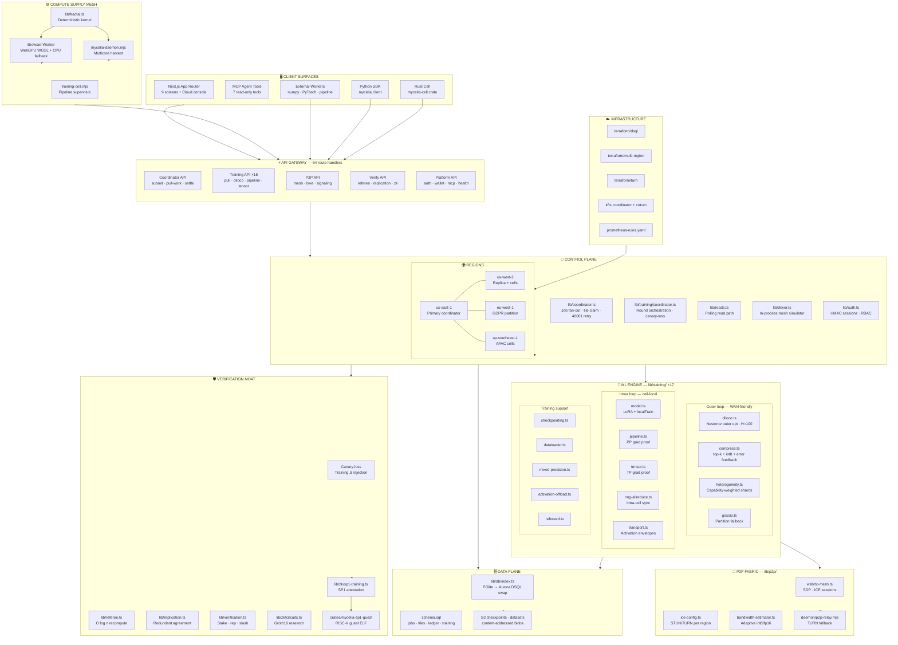

---

### Diagram 2 — End-to-end request & data plane

Every write path flows through validation → coordinator → single DB connection. Reads poll through `reads.ts`. Background simulation keeps the mesh alive.

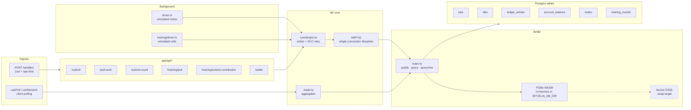

---

### Diagram 3 — Training round sequence (Regime 1)

One full DiLoCo round: fan-out → H local steps → compress → verify → outer merge → pay.

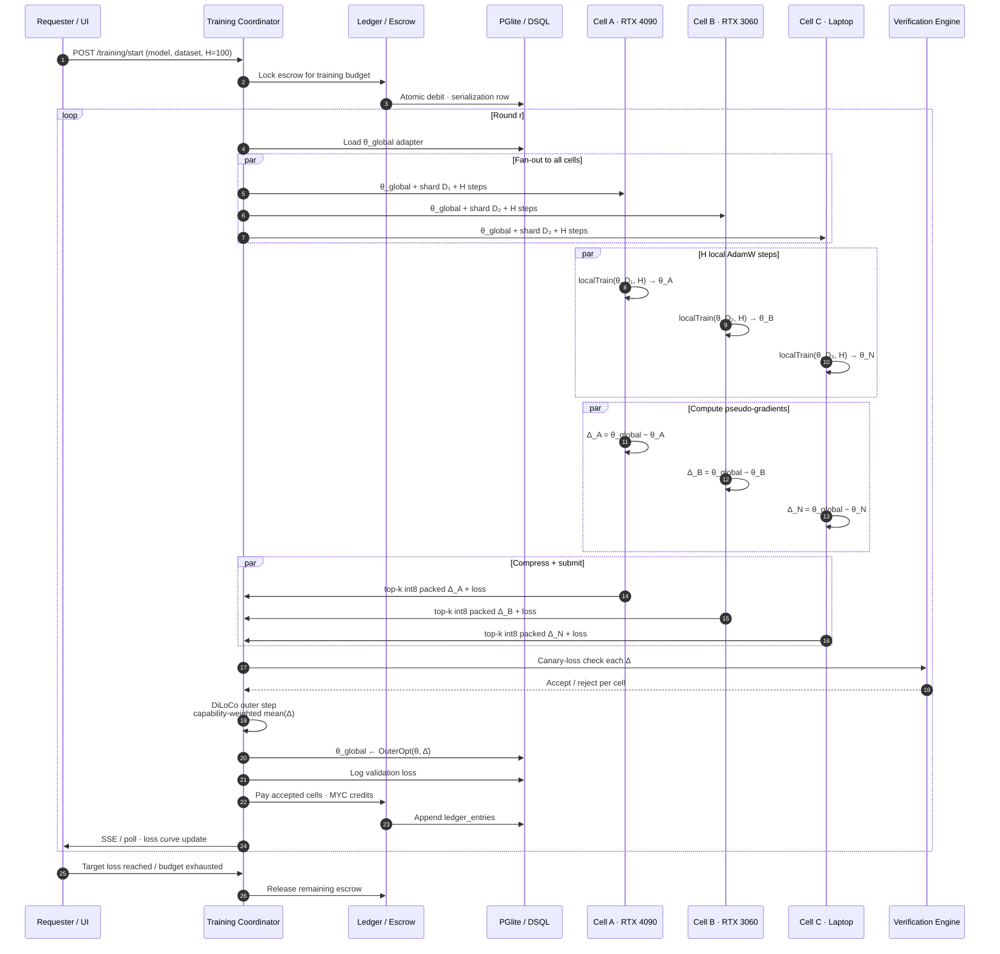

---

### Diagram 4 — Regime 1 vs Regime 2 cell topology

The **cell** abstraction unifies both regimes. Outer DiLoCo loop is identical; inner connectivity differs radically.

```mermaid
flowchart TB
    subgraph GLOBAL["GLOBAL COORDINATOR — DiLoCo outer loop"]
        THETA["θ_global adapter<br/>few MB · sync every H steps"]
        OUTER["OuterOpt Nesterov<br/>capability-weighted Δ merge"]
    end

    subgraph R1["REGIME 1 — Data parallel · LIVE"]
        direction TB
        R1A["Cell A = Node A<br/>1× RTX 4090 · shard 1"]
        R1B["Cell B = Node B<br/>1× RTX 3060 · shard 2"]
        R1C["Cell C = Node C<br/>Laptop GPU · shard 3"]
        R1D["Cell D = Node D<br/>Browser WebGPU · shard 4"]
    end

    subgraph R2["REGIME 2 — Model sharded · PROOF + WIRE ROADMAP"]
        direction TB
        subgraph CELL_D["Cell D = 4-stage pipeline · Llama 70B"]
            S1["Stage 1 · layers 0-19<br/>W_qkv shard"]
            S2["Stage 2 · layers 20-39"]
            S3["Stage 3 · layers 40-59"]
            S4["Stage 4 · layers 60-79<br/>W_down shard"]
            S1 -->|"activation h₁<br/>WebRTC DC"| S2
            S2 -->|"activation h₂"| S3
            S3 -->|"activation h₃"| S4
            S4 -->|"grad ∂h₃"| S3
            S3 -->|"grad ∂h₂"| S2
            S2 -->|"grad ∂h₁"| S1
        end
    end

    THETA --> R1A & R1B & R1C & R1D
    THETA --> CELL_D
    R1A & R1B & R1C & R1D -->|"Δ_A Δ_B Δ_C Δ_D<br/>top-k int8 over WAN"| OUTER
    CELL_D -->|"Δ_cell<br/>single pseudo-grad"| OUTER
    OUTER --> THETA

    style R1 fill:#0d2a24,stroke:#6fd3b8
    style R2 fill:#2a1f0d,stroke:#d8a25a
```

---

### Diagram 5 — Pipeline-parallel micro-batch flow (Regime 2)

GPipe-style forward/backward across stages. Activations never touch the coordinator — only signaling does.

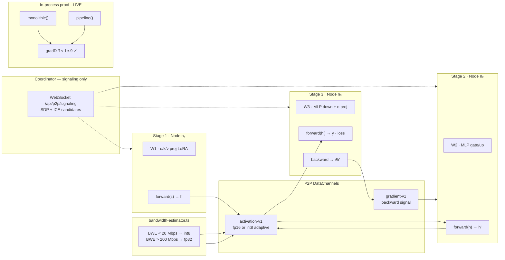

---

### Diagram 6 — Verification escalation pipeline

Every workload class declares its verification primitive. Training escalates through four tiers.

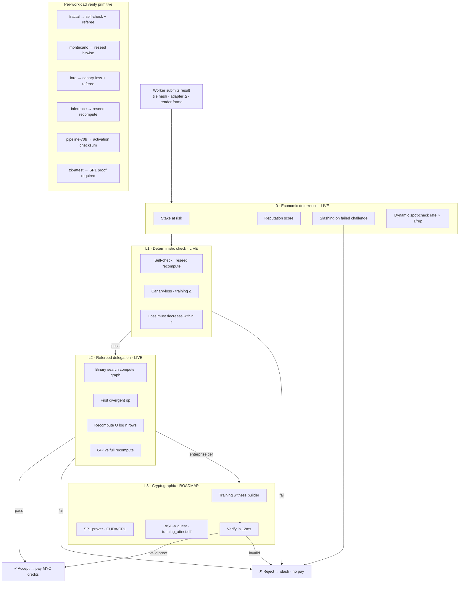

---

### Diagram 7 — Escrow & ledger state machine

The ledger invariant: **no overdraft, escrow always covers pending payouts, settlement is idempotent.**

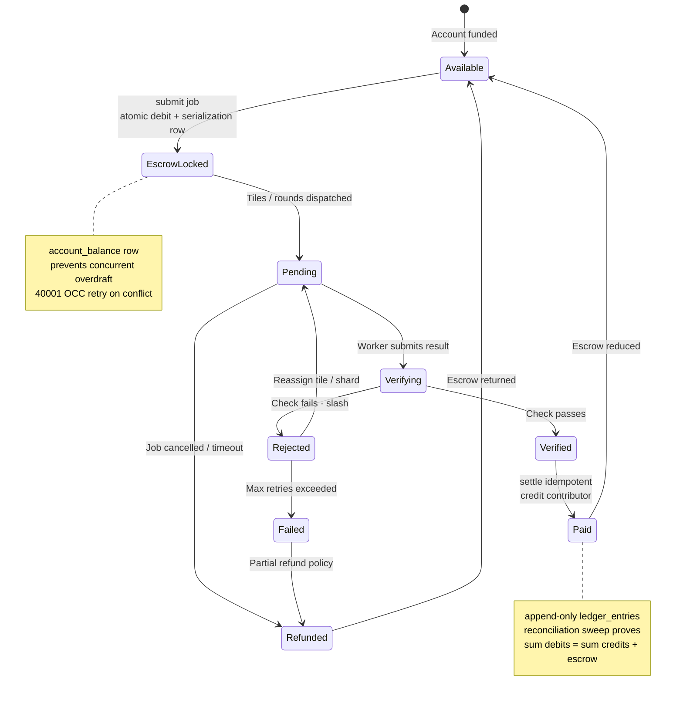

---

### Diagram 8 — Job & tile lifecycle

From NL submission to reassembled image or completed training round.

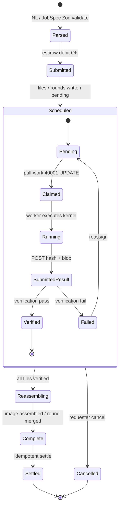

---

### Diagram 9 — Multi-region deployment topology

Production topology: regional coordinators, TURN pools, DSQL replicas, checkpoint buckets.

```mermaid
flowchart TB
    subgraph DNS["Route 53 · Global"]
        R53["coordinator.mycelia.dev<br/>health-checked failover"]
    end

    subgraph USE1["🇺🇸 us-east-1 · PRIMARY"]
        COORD1["Coordinator ECS ×3<br/>Next.js + PGlite leader"]
        DSQL1["Aurora DSQL leader"]
        TURN1["coturn Fargate ×3"]
        S3_1["S3 checkpoints-us-east"]
        CELLS1["Cells · 4090 fleet"]
    end

    subgraph USW2["🇺🇸 us-west-2"]
        COORD2["Coordinator replica"]
        DSQL2["DSQL async replica"]
        TURN2["coturn ×2"]
        S3_2["S3 checkpoints-us-west"]
        CELLS2["Cells · mixed GPUs"]
    end

    subgraph EUW1["🇪🇺 eu-west-1 · GDPR"]
        COORD3["Coordinator replica"]
        DSQL3["DSQL async replica"]
        TURN3["coturn ×2"]
        S3_EU["S3 datasets-eu · residency"]
        CELLS3["EU-only data shards"]
    end

    subgraph APSE1["🇸🇬 ap-southeast-1"]
        TURN4["coturn ×2"]
        CELLS4["APAC cells"]
    end

    subgraph FAILOVER["Partition handling"]
        SWIM["SWIM gossip · membership.ts"]
        GOSSIP2["gossip.ts delta fallback"]
        PART["partition.ts split-brain detect"]
    end

    R53 --> COORD1
    R53 -.-> COORD2
    R53 -.-> COORD3
    COORD1 --> DSQL1
    DSQL1 -.-> DSQL2 & DSQL3
    COORD1 --> TURN1
    COORD2 --> TURN2
    COORD3 --> TURN3
    CELLS1 & CELLS2 & CELLS3 & CELLS4 --> COORD1
    CELLS1 -.->|"WebRTC DC<br/>same-metro PP only"| CELLS1
    SWIM --> PART
    PART --> GOSSIP2

    style USE1 fill:#0d2a24,stroke:#6fd3b8
    style EUW1 fill:#1a1a2e,stroke:#6fd3b8
```

---

### Diagram 10 — Module dependency graph

How `lib/` modules compose. Single DB swap point; fractal kernel isomorphic server/browser.

```mermaid
flowchart BT
    subgraph UI["components/ + app/"]
        NET_UI["network/ training-panel"]
        TRUST_UI["verification/"]
        CLOUD_UI["cloud/ console"]
    end

    subgraph API["app/api/"]
        API_ALL["54 route handlers"]
    end

    subgraph WRITE["Write path"]
        COORD["coordinator.ts"]
        TC["training/coordinator.ts"]
    end

    subgraph READ["Read path"]
        READS["reads.ts"]
        HEALTH["health.ts reconciliation"]
    end

    subgraph KERNEL["Deterministic kernels"]
        FRACTAL["fractal.ts"]
        TRAIN_MODEL["training/model.ts"]
        PIPELINE["training/pipeline.ts"]
        TENSOR["training/tensor.ts"]
        INFER["inference.ts"]
        MC["montecarlo.ts"]
    end

    subgraph TRUST["Trust layer"]
        VER["verification.ts"]
        REF["referee.ts"]
        REP["replication.ts"]
        SANDBOX["sandbox.ts"]
        ZK["zk/sp1-training.ts"]
    end

    subgraph COMM["Communication"]
        COMP["training/compress.ts"]
        DILOCO["training/diloco.ts"]
        P2P["p2p/webrtc-mesh.ts"]
        TRANS["training/transport.ts"]
    end

    subgraph PERSIST["Persistence"]
        DB["db/index.ts"]
        SEED["db/seed.ts"]
    end

    UI --> API
    API --> WRITE & READ
    WRITE --> COORD & TC
    COORD --> FRACTAL & DB
    TC --> TRAIN_MODEL & COMP & DILOCO & VER
    TC --> PIPELINE & TENSOR
    READ --> DB
    HEALTH --> DB
    VER --> REF & REP
    VER --> ZK
    PIPELINE --> TRANS --> P2P
    TENSOR --> COMP
    FRACTAL --> SANDBOX

    style DB fill:#0d2a24,stroke:#6fd3b8,stroke-width:3px
```

---

### Diagram 11 — Data model entity relationships

Core Postgres schema — jobs fan out to tiles; training rounds fan out to contributions; ledger is append-only.

```mermaid
erDiagram
    ACCOUNTS ||--o{ LEDGER_ENTRIES : posts
    ACCOUNTS ||--|| ACCOUNT_BALANCE : serializes
    ACCOUNTS ||--o{ JOBS : submits
    JOBS ||--|{ TILES : fans_out
    TILES }o--|| NODES : claimed_by
    NODES ||--o{ HEARTBEATS : emits
    NODES }o--o{ CELL_MEMBERS : belongs_to

    TRAINING_JOBS ||--|{ TRAINING_ROUNDS : contains
    TRAINING_ROUNDS ||--o{ CONTRIBUTIONS : collects
    CONTRIBUTIONS }o--|| NODES : submitted_by
    TRAINING_JOBS ||--|| ADAPTERS : tracks_theta

    JOBS {
        uuid id PK
        text status
        numeric escrow_amount
        jsonb jobspec
        timestamptz deadline
    }

    TILES {
        uuid id PK
        uuid job_id FK
        int tile_x tile_y
        text status
        uuid node_id FK
        text result_hash
    }

    LEDGER_ENTRIES {
        bigserial id PK
        uuid account_id FK
        text kind
        numeric amount
        uuid ref_id
        timestamptz at
    }

    ACCOUNT_BALANCE {
        uuid account_id PK
        numeric available
        numeric escrow
        int version
    }

    NODES {
        uuid id PK
        text name
        text gpu_model
        text region
        float reputation
        numeric stake
    }

    TRAINING_ROUNDS {
        uuid id PK
        int round_num
        bytea adapter_snapshot
        float val_loss
        text status
    }

    CONTRIBUTIONS {
        uuid id PK
        uuid round_id FK
        uuid node_id FK
        bytea delta_compressed
        float loss_before loss_after
        bool accepted
    }

    CELL_MEMBERS {
        uuid node_id FK
        text cell_id
        int stage_index
        text health
    }
```

---

Full reference: [`docs/ARCHITECTURE.md`](docs/ARCHITECTURE.md) · Training deep-dive: [`docs/ML_LAYER.md`](docs/ML_LAYER.md) · Stack map: [`docs/TRAINING_STACK.md`](docs/TRAINING_STACK.md) · Transport: [`docs/TRANSPORT_LAYER.md`](docs/TRANSPORT_LAYER.md)

---

## The distributed training stack

Mycelia's ML layer is not a slide deck. It is **17 modules, 15 training API routes, 2 protobuf services, 2 JSON schemas, 2 YAML job configs, a Python SDK, and two Rust crates** — all cross-referenced to a single design doc.

### Two levels of splitting

The entire design rests on one insight: **split data often, split models only when forced.**

```mermaid
flowchart TB
    JOB["TRAINING JOB<br/>Fine-tune LoRA θ on dataset D<br/>base frozen · 4-bit QLoRA"]

    subgraph OUTER["OUTER LOOP — sync every H=100 steps · WAN-friendly"]
        FAN["Coordinator fan-out<br/>θ_global + shard ref to each cell"]
        LOCAL["H local AdamW steps per cell"]
        DELTA["Pseudo-grad Δ = θ_global − θ_local"]
        PACK["top-k + int8 + error feedback<br/>~50× compression vs dense fp32"]
        MERGE["DiLoCo OuterOpt<br/>capability-weighted Nesterov"]
        VAL["Validation loss ↓ · pay accepted cells"]
    end

    subgraph CELLS["CELLS — data parallel across the mesh"]
        CA["Cell A · RTX 4090<br/>shard 1 · 1200 tok/s"]
        CB["Cell B · RTX 3060<br/>shard 2 · 800 tok/s"]
        CC["Cell C · Laptop<br/>shard 3 · 400 tok/s"]
        CD["Cell D · 4-stage pipeline<br/>Llama 70B · ROADMAP"]
    end

    JOB --> FAN
    FAN --> CA & CB & CC & CD
    CA & CB & CC & CD --> LOCAL
    LOCAL --> DELTA --> PACK --> MERGE --> VAL
    VAL -->|"round r+1"| FAN

    style OUTER fill:#0d2a24,stroke:#6fd3b8
    style CD fill:#2a1f0d,stroke:#d8a25a
```

### Communication compression pipeline

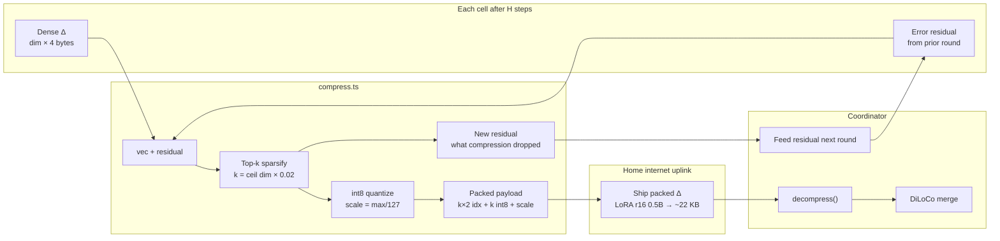

**Regime 1** (live): one GPU per cell, pure data-parallel LoRA — the hero demo with a real validation-loss drop on the Network screen.

**Regime 2** (proof-complete, wire roadmap): pipeline/tensor parallel within a cell — activations cross WebRTC DataChannels; gradients proven **bit-identical to monolithic** in-process.

### Training module map

| Module | Purpose |
|--------|---------|
| [`model.ts`](frontend/lib/training/model.ts) | Tiny LoRA adapter + deterministic `localTrain()` |
| [`coordinator.ts`](frontend/lib/training/coordinator.ts) | Round orchestration, canary-loss, payouts |
| [`diloco.ts`](frontend/lib/training/diloco.ts) | Outer Nesterov optimizer, H-step sync |
| [`compress.ts`](frontend/lib/training/compress.ts) | Top-k + int8 + error feedback (DeMo/DisTrO lineage) |
| [`pipeline.ts`](frontend/lib/training/pipeline.ts) | 2-stage MLP pipeline proof — grad-equivalent to monolithic |
| [`tensor.ts`](frontend/lib/training/tensor.ts) | Column/row tensor parallel proof |
| [`partition.ts`](frontend/lib/training/partition.ts) | Heterogeneity-aware stage partitioning |
| [`ring-allreduce.ts`](frontend/lib/training/ring-allreduce.ts) | Intra-cell gradient sync (NCCL fallback) |
| [`transport.ts`](frontend/lib/training/transport.ts) | Activation wire budget + envelope ordering |
| [`heterogeneity.ts`](frontend/lib/training/heterogeneity.ts) | Capability-weighted shard assignment |
| [`checkpointing.ts`](frontend/lib/training/checkpointing.ts) | Content-addressed adapter snapshots |
| [`dataloader.ts`](frontend/lib/training/dataloader.ts) | Deterministic shards for refereed recompute |
| [`mixed-precision.ts`](frontend/lib/training/mixed-precision.ts) | QLoRA bf16/fp32 policy |
| [`activation-offload.ts`](frontend/lib/training/activation-offload.ts) | ZeRO-Offload for VRAM-constrained nodes |
| [`gossip.ts`](frontend/lib/training/gossip.ts) | Epidemic delta propagation (partition fallback) |
| [`refereed.ts`](frontend/lib/training/refereed.ts) | Training-specific O(log n) recompute |
| [`driver.ts`](frontend/lib/training/driver.ts) | In-process simulated training cells |

### P2P + transport layer

Pipeline stages don't talk through the coordinator for activations — that would melt the control plane. They talk **peer-to-peer**:

| Module | Role |
|--------|------|
| [`webrtc-mesh.ts`](frontend/lib/p2p/webrtc-mesh.ts) | Signaling session lifecycle, SDP exchange |
| [`ice-config.ts`](frontend/lib/p2p/ice-config.ts) | STUN/TURN bundles per region |
| [`bandwidth-estimator.ts`](frontend/lib/p2p/bandwidth-estimator.ts) | Adaptive int8 vs fp16 on constrained uplinks |

Proto: [`proto/p2p/v1/signaling.proto`](proto/p2p/v1/signaling.proto) · Daemon relay: [`daemon/p2p-relay.mjs`](daemon/p2p-relay.mjs)

### Zero-knowledge attestation

| Module | Role |
|--------|------|
| [`sp1-training.ts`](frontend/lib/zk/sp1-training.ts) | Witness builder + stub prove/verify |
| [`circuits.ts`](frontend/lib/zk/circuits.ts) | Groth16 research circuits (grad-norm bounds) |
| [`crates/mycelia-sp1-guest/`](crates/mycelia-sp1-guest/) | RISC-V guest binary for SP1 zkVM |

Route: `GET /api/verify/zk` · ADR: [`docs/adr/003-sp1-training-attestation.md`](docs/adr/003-sp1-training-attestation.md)

---

## Verification at planetary scale

Untrusted nodes lie. Mycelia's moat is **per-workload verification primitives** with escalating guarantees:

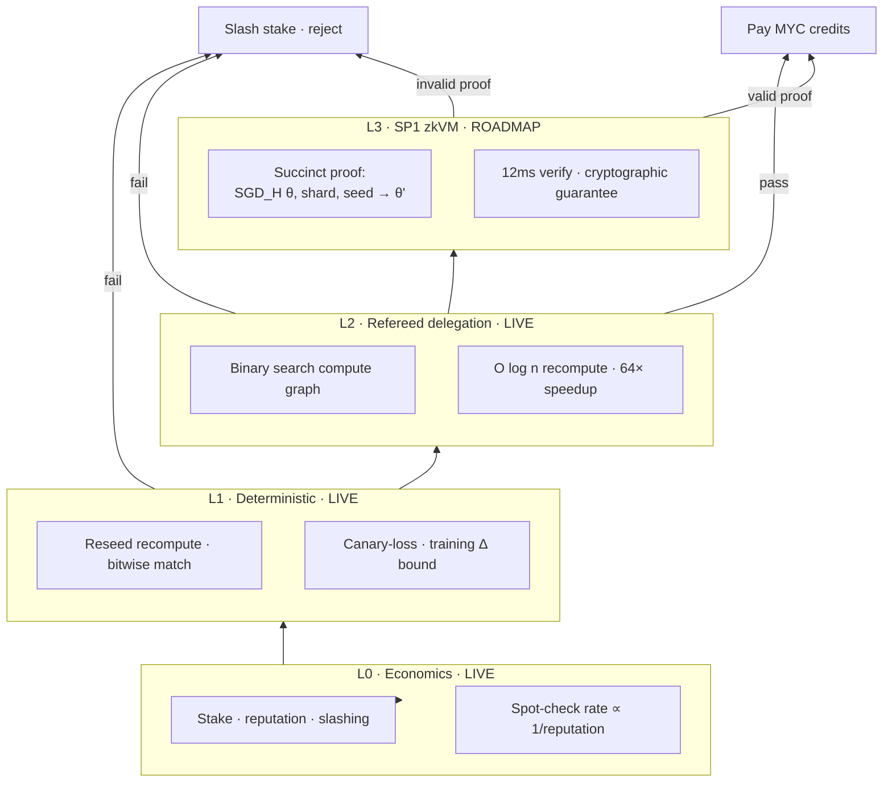

### Workload verification matrix

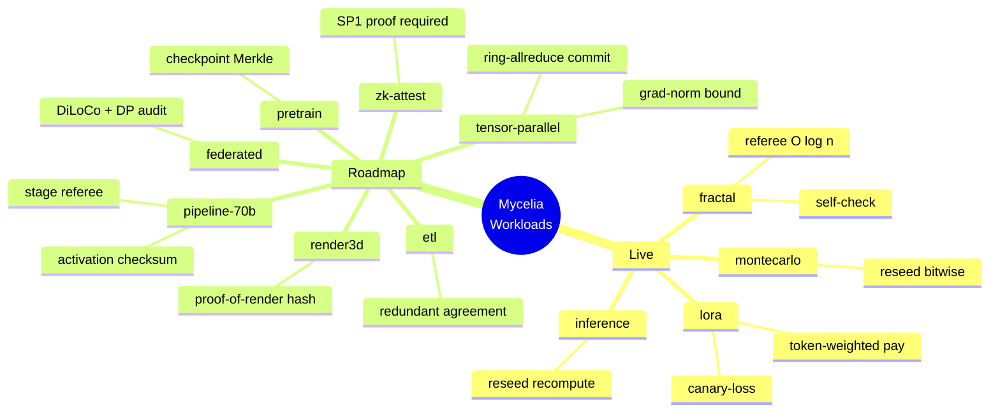

**Escrow-until-verified** on every workload: requesters prepay into escrow atomically (no overdraft race); contributors are paid **only** when verification passes; settlement is idempotent.

---

## What's live right now

This is not a mockup. The following run **today**, locally, with zero cloud provisioning:

### Compute & rendering
- **Live coordinator** — `/submit`, `/pull-work`, `/submit-result`, `/settle` as stateless handlers with 40001 OCC retry
- **Real distributed fractal render** — deterministic deep-zoom Mandelbrot fans out across simulated fleet **and** real browser WebGPU/CPU workers; tiles reassemble into one image on the Network screen
- **"Join the mesh" browser worker** — zero install, WGSL compute shader with per-tile GPU timing telemetry
- **Native daemon** — [`daemon/mycelia-daemon.mjs`](daemon/mycelia-daemon.mjs) harvests idle multicore CPU via worker threads; launchd/systemd install scripts included

### Distributed training
- **Converging LoRA fine-tune** — frozen base + trainable adapter, DiLoCo/FedAvg outer loop, **canary-loss rejects bad deltas**, token-weighted payouts; live validation-loss chart on Network screen
- **Pipeline + tensor parallel proofs** — gradients proven equivalent to monolithic single-node (`maxGradDiff < 1e-9`)
- **Communication compression** — top-k + int8 + error feedback; convergence preserved (unit-tested)
- **External workers** — open pull/contribute API; [`examples/train_worker.py`](examples/train_worker.py), [`train_worker_pytorch.py`](examples/train_worker_pytorch.py), [`pipeline_stage_worker.py`](examples/pipeline_stage_worker.py)

### Trust, economics, platform
- **Stake / reputation / slashing** — failed challenges slash stake and raise spot-check rate; Trust screen shows live unit economics (+$0.084/node-hour proven path)
- **Refereed-delegation recompute** — O(log n) verification, live on Trust screen
- **7 workload classes** — fractal, Monte Carlo, LoRA, inference, 3D render, ETL, pipeline-70B, tensor-parallel, zk-attest, pretrain, federated ([`lib/workloads.ts`](frontend/lib/workloads.ts))
- **Auth + roles** — HMAC sessions, provider/requester RBAC, submit gated server-side
- **Capability sandbox** — untrusted kernels in denied `node:vm` slice with hard time cap
- **MYC redemption** — bank/gift-card/crypto cash-out with KYC disclosure
- **Read-only MCP server** — 7 agent tools over JSON-RPC (`/api/mcp`)
- **NL job submission** — Claude Opus structured output → Zod re-validation → `/submit`; keyword fallback without API key
- **Multi-region payouts** — region-weighted settlement ([`lib/regions.ts`](frontend/lib/regions.ts))
- **Cloud console** — architecture diagram + DSQL status ([`/cloud`](frontend/app/cloud/page.tsx))

### Hardening & observability
- Zod validation on every write endpoint + token-bucket rate limiting
- Ledger reconciliation sweep — proves no overdraft, escrow covers all pending payouts
- Health strip — tile status, mesh liveness, trust counters, per-worker heartbeat
- **92 Vitest unit tests** + **live smoke integration** — both in CI

---

## Repository map

```
Mycelia/
├── frontend/                    # Next.js 16 App Router — the entire MVP
│   ├── app/api/                 # 54 route handlers (coordinator, training, p2p, zk, mcp…)
│   ├── lib/
│   │   ├── training/            # 17 modules — the ML layer
│   │   ├── p2p/                 # WebRTC mesh, ICE, bandwidth estimator
│   │   ├── zk/                  # SP1 attestation + circuit metadata
│   │   ├── distributed/         # Cell membership, partition tolerance
│   │   ├── models/              # HF registry, Megatron shard specs
│   │   ├── db/                  # PGlite bootstrap, schema, seed, OCC retry
│   │   └── …                    # coordinator, referee, verification, wallet, sandbox
│   ├── components/              # 7 screens + cloud console + shadcn/ui
│   └── test/                    # 19 unit files + smoke.mjs + fuzz.mjs
├── daemon/                      # Native supply engine + training cell + P2P relay
├── crates/
│   ├── mycelia-cell/            # Rust training worker (tokio + reqwest + ndarray)
│   └── mycelia-sp1-guest/       # SP1 zkVM RISC-V guest binary
├── sdk/python/mycelia/          # Production Python client + compress_topk
├── proto/                       # gRPC: coordinator + WebRTC signaling
├── schemas/                     # JSON Schema: training-job, cell-topology
├── configs/training/            # Llama 8B LoRA + 70B pipeline YAML
├── infra/
│   ├── terraform/               # Aurora DSQL, TURN Fargate, multi-region
│   ├── k8s/                     # Coordinator Deployment, coturn DaemonSet
│   └── monitoring/              # Prometheus alert rules
├── examples/                    # numpy, PyTorch, pipeline stage workers
├── docs/                        # ARCHITECTURE, ML_LAYER, TRANSPORT, ZK, ADRs…
├── PLAN.md                      # Master plan (Phases 0–6)
└── CLAUDE.md                    # Agent quickstart
```

---

## API surface

<details>
<summary><strong>Coordinator & marketplace (14 routes)</strong></summary>

| Route | Method | Purpose |
|-------|--------|---------|
| `/api/submit` | POST | Submit job → escrow debit |
| `/api/pull-work` | POST | Claim tile (40001-safe) |
| `/api/submit-result` | POST | Submit tile result |
| `/api/settle` | POST | Idempotent settlement |
| `/api/marketplace` | GET | Job board |
| `/api/jobs/parse` | POST | NL → JobSpec |
| `/api/nodes/register` | POST | Join mesh |
| `/api/heartbeat` | POST | Liveness |
| `/api/network` | GET | Mesh topology |
| `/api/network/stream` | GET | SSE tile stream |
| `/api/stats` | GET | Global stats |
| `/api/dashboard` | GET | Dashboard aggregate |
| `/api/ledger` | GET | Ledger entries |
| `/api/regions` | GET | Region config |

</details>

<details>
<summary><strong>Distributed training (15 routes)</strong></summary>

| Route | Purpose |
|-------|---------|
| `/api/training/pull` | Pull training round |
| `/api/training/submit-contribution` | Submit adapter Δ |
| `/api/training/active` | Active training job |
| `/api/training/adapter` | Current adapter weights |
| `/api/training/comms` | Compression budget metrics |
| `/api/training/pipeline` | PP grad-equivalence proof |
| `/api/training/tensor` | TP grad-equivalence proof |
| `/api/training/diloco` | Outer optimizer demo |
| `/api/training/ring` | Ring all-reduce metrics |
| `/api/training/transport` | Activation wire budget |
| `/api/training/sharding` | Heterogeneity-aware shards |
| `/api/training/checkpoints` | Adapter snapshots |
| `/api/training/dataloader` | Deterministic shard iterator |
| `/api/training/metrics` | OTel/Prometheus export |
| `/api/training/referee` · `/serving` | Refereed + inference serve |

</details>

<details>
<summary><strong>P2P, verification, models, platform (25 routes)</strong></summary>

| Group | Routes |
|-------|--------|
| **P2P** | `/api/p2p/mesh`, `/api/p2p/bwe` |
| **ZK** | `/api/verify/zk`, `/api/verify/referee`, `/api/verify/replication` |
| **Distributed** | `/api/distributed/membership` |
| **Models** | `/api/models` |
| **Workloads** | `/api/inference`, `/api/montecarlo`, `/api/render3d`, `/api/etl` |
| **Trust** | `/api/verification`, `/api/wallet`, `/api/wallet/redeem` |
| **Auth** | `/api/auth/login`, `/api/auth/logout`, `/api/auth/me` |
| **Ops** | `/api/health`, `/api/cloud`, `/api/sandbox/demo`, `/api/mcp` |

</details>

### Quick proof curls

```bash
cd frontend && pnpm dev   # http://localhost:3000

curl localhost:3000/api/training/pipeline    # PP grad-equivalence
curl localhost:3000/api/training/diloco     # DiLoCo outer loop
curl localhost:3000/api/training/comms      # 50× compression ratio
curl localhost:3000/api/p2p/mesh            # WebRTC signaling topology
curl localhost:3000/api/verify/zk           # SP1 attestation stub
curl localhost:3000/api/models              # Llama/Mistral/DeepSeek registry
curl localhost:3000/api/training/metrics?format=prometheus
```

---

## Worker ecosystem

```mermaid
flowchart TB
    subgraph JOIN["Join the mesh"]
        REG["POST /api/nodes/register<br/>name · gpuModel · region"]
    end

    subgraph WORKERS["Worker runtimes"]
        direction TB
        B["Browser<br/>fractal-worker.js<br/>WebGPU + CPU"]
        D["Daemon<br/>mycelia-daemon.mjs<br/>worker_threads"]
        TC["Training cell<br/>training-cell.mjs<br/>supervises stages"]
        PY["Python numpy<br/>train_worker.py"]
        PT["PyTorch<br/>train_worker_pytorch.py"]
        PS["Pipeline stage<br/>pipeline_stage_worker.py"]
        RS["Rust cell<br/>crates/mycelia-cell"]
    end

    subgraph LOOP["Contribution loop"]
        PULL["POST /training/pull<br/>round + adapter + shard"]
        EXEC["localTrain / render / MC<br/>H steps or tile compute"]
        SUB["POST /training/submit-contribution<br/>Δ + loss_before + loss_after"]
        VER["Canary-loss verify"]
        PAY["MYC credit payout"]
    end

    REG --> WORKERS
    B & D & PY & PT & RS --> PULL
    TC --> PS
    PS --> PULL
    PULL --> EXEC --> SUB --> VER
    VER -->|accepted| PAY
    VER -->|rejected| PULL

    style PAY fill:#0d2a24,stroke:#6fd3b8
```

| Worker | Language | Path | Use case |
|--------|----------|------|----------|
| Browser mesh | JS/WGSL | `public/fractal-worker.js` | Zero-install GPU/CPU tiles + LoRA |
| Native daemon | Node.js | `daemon/mycelia-daemon.mjs` | Multicore CPU harvest |
| Training cell | Node.js | `daemon/training-cell.mjs` | Multi-stage pipeline supervisor |
| P2P relay | Node.js | `daemon/p2p-relay.mjs` | TURN fallback dev stub |
| Reference worker | Python | `examples/train_worker.py` | numpy pull/contribute loop |
| PyTorch worker | Python | `examples/train_worker_pytorch.py` | PEFT + bitsandbytes path |
| Pipeline stage | Python | `examples/pipeline_stage_worker.py` | Regime-2 stage simulator |
| Python SDK | Python | `sdk/python/mycelia/client.py` | Production client library |
| Rust cell | Rust | `crates/mycelia-cell/` | High-throughput native worker |

Join the mesh as an external trainer:

```bash
pip install requests numpy
python examples/train_worker.py          # numpy reference
python examples/train_worker_pytorch.py  # torch if installed
./scripts/demo-training-mesh.sh 5        # spin up 5 cells + pipeline stages
```

---

## The database: built real, AWS deferred

Production targets **Amazon Aurora DSQL** — but this build provisions **zero AWS**. The entire data layer runs on **PGlite** (embedded Postgres-in-WASM). Because DSQL is Postgres-compatible, the SQL, transactions, OCC-retry wrapper, and single-connection discipline are the *real* design:

```typescript
// Swap point — one file, not a rewrite
frontend/lib/db/index.ts  →  @aws/aurora-dsql-nodejs connector
```

Schema: [`frontend/lib/db/schema.sql`](frontend/lib/db/schema.sql) · Bootstrap: [`scripts/db-setup.mjs`](frontend/scripts/db-setup.mjs) · AWS guide: [`docs/AWS_ONBOARDING.md`](docs/AWS_ONBOARDING.md)

---

## Run it

```bash
cd frontend
pnpm install
pnpm dev              # http://localhost:3000 — PGlite migrates + seeds on first request
```

1. Open **Network** → click **Join the mesh** (WebGPU fractal + training contribution)
2. Open **Marketplace** → submit a job in plain English
3. Watch tiles render and validation loss drop in real time

Optional:

```bash
export ANTHROPIC_API_KEY=sk-ant-...     # real Claude NL parsing (else keyword fallback)
export MYCELIA_DB_DIR=./data            # persist PGlite across restarts
export MYCELIA_COORDINATOR=http://localhost:3000  # for external workers
```

Full demo script: [`docs/DEMO.md`](docs/DEMO.md)

### Test

```bash
cd frontend
pnpm test                # 92 Vitest unit tests — fractal, training, PP/TP, compress,
                         # economics, referee, zk stub, distributed-training…

pnpm dev                 # terminal 1
pnpm test:smoke          # terminal 2 — live integration: escrow, overdraft,
                         # cheat-rejection, slashing, training convergence,
                         # reconciliation, MCP surface, hardening
pnpm test:fuzz           # property-based fuzz (state machine)
```

CI: [`.github/workflows/ci.yml`](.github/workflows/ci.yml) on every PR.

### Build & deploy

```bash
cd frontend && pnpm build     # production build (must stay green)
./scripts/deploy-coordinator.sh staging   # Terraform + ECS dry-run
```

---

## Infrastructure (roadmap topology)

```mermaid
flowchart TB
    subgraph TF["Terraform modules"]
        MOD_DSQL["dsql/<br/>Aurora cluster"]
        MOD_MULTI["multi-region/<br/>Route53 + replicas"]
        MOD_TURN["turn/<br/>coturn Fargate NLB"]
    end

    subgraph K8S["Kubernetes"]
        DEPLOY["coordinator-deployment.yaml<br/>3 replicas · 4 CPU · 8Gi"]
        DS["turn-daemonset.yaml<br/>hostNetwork UDP 3478"]
    end

    subgraph OBS["Observability"]
        PROM["prometheus-rules.yaml"]
        METRICS["/api/training/metrics?format=prometheus"]
        HEALTH["lib/health.ts reconciliation"]
    end

    subgraph LIVE["Live today"]
        PGLITE["PGlite in-process"]
        CLOUD_UI["/cloud architecture diagram"]
    end

    MOD_DSQL --> PGLITE
    MOD_MULTI --> DEPLOY
    MOD_TURN --> DS
    PROM --> METRICS
    HEALTH --> PROM
    DEPLOY --> CLOUD_UI

    style LIVE fill:#0d2a24,stroke:#6fd3b8
```

| Component | Config | Status |
|-----------|--------|--------|
| Aurora DSQL cluster | `infra/terraform/dsql/` | Roadmap — swap in `lib/db/index.ts` |
| Multi-region coordinator | `infra/terraform/multi-region/` | Roadmap |
| TURN relay (coturn) | `infra/terraform/turn/` + `infra/k8s/turn-daemonset.yaml` | Roadmap |
| Coordinator ECS | `infra/k8s/coordinator-deployment.yaml` | Roadmap |
| Prometheus alerts | `infra/monitoring/prometheus-rules.yaml` | Roadmap |
| Cloud console UI | `frontend/app/cloud/` | Live (PGlite status + architecture diagram) |

---

## Technology stack

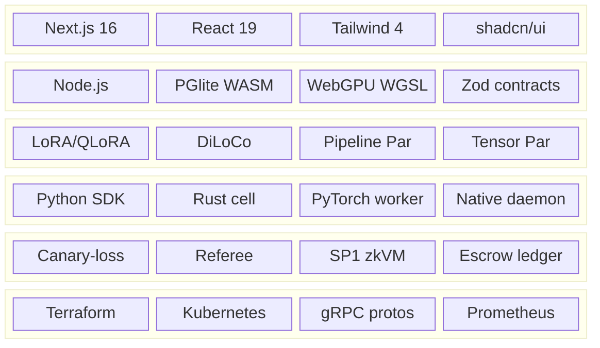

---

## Documentation

| Doc | Contents |
|-----|----------|
| [`PLAN.md`](PLAN.md) | Master plan — vision, phases 0–6, economics |
| [`docs/ARCHITECTURE.md`](docs/ARCHITECTURE.md) | Data model, job lifecycle, ledger invariants, API |
| [`docs/ML_LAYER.md`](docs/ML_LAYER.md) | **Distributed training bible** — cells, DiLoCo, Regime 1/2 |
| [`docs/TRAINING_STACK.md`](docs/TRAINING_STACK.md) | Module map + live vs roadmap matrix |
| [`docs/TRANSPORT_LAYER.md`](docs/TRANSPORT_LAYER.md) | WebRTC activation transport, wire budgets |
| [`docs/ZK_VERIFICATION.md`](docs/ZK_VERIFICATION.md) | SP1 attestation pipeline |
| [`docs/MULTI_REGION.md`](docs/MULTI_REGION.md) | Regional topology + failover |
| [`docs/DEMO.md`](docs/DEMO.md) | Click-by-click hackathon demo |
| [`docs/ACCEPTANCE.md`](docs/ACCEPTANCE.md) | Acceptance criteria |
| [`docs/AWS_ONBOARDING.md`](docs/AWS_ONBOARDING.md) | DSQL + async backend integration |
| [`docs/adr/`](docs/adr/) | Architecture Decision Records (DiLoCo, WebRTC, SP1) |
| [`CLAUDE.md`](CLAUDE.md) | AI agent contributor guide |

---

## Roadmap

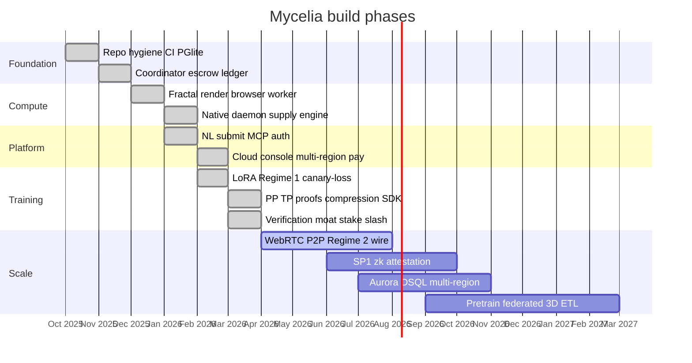

| Phase | Milestone | Status |
|-------|-----------|--------|
| 0 | Repo hygiene, CI, PGlite | ✅ |
| 1 | Coordinator + escrow ledger | ✅ Live |
| 2 | Distributed fractal + browser worker | ✅ Live |
| 3 | NL submit + MCP + auth | ✅ Live |
| 4 | LoRA training Regime 1 + canary-loss | ✅ Live |
| 5 | Verification moat (stake/referee/slash) | ✅ Live |
| 5b | PP/TP proofs + compression + SDK | ✅ Live |
| 6 | WebRTC P2P activations + Regime 2 wire | 🔨 Signaling modeled, wire pending |
| 7 | SP1 zk attestation | 🔨 Guest + stub prove/verify |
| 8 | Aurora DSQL + multi-region failover | 🔨 PGlite swap point ready |
| 9 | Full pretrain + federated + 3D/ETL workloads | 📋 Registry + stubs |

Tracked as GitHub issues per phase. The gap between demo and production is **infrastructure, not architecture** — the math is proven, the protocols are defined, the swap points are documented.

---

## Vision

We are not building another GPU rental marketplace. We are building the **immune system for planetary-scale ML** — where every laptop is a neuron, every adapter sync is a synapse, and every verified contribution is rewarded by a ledger that **cannot pay cheaters**.

The forest floor is already there. **Mycelia is what grows on it.**

<div align="center">

*Many small nodes · One living organism · Train anywhere*

**[⭐ Star this repo](https://github.com/GodlyDonuts/Mycelia)** if you believe AI training belongs to everyone, not just hyperscalers.

</div>
